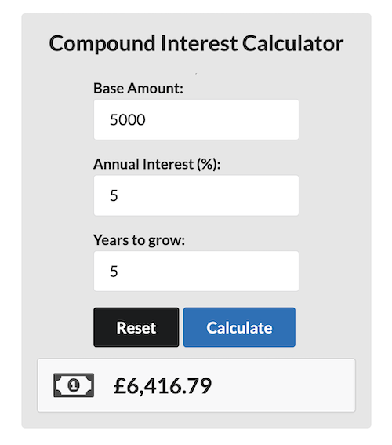

## Compound Interest Calculator

The magic of compound interest! 

Suppose Lucy invests £100 in a bank account that offers an annual interest rate of 5%. The interest is compounded annually. After 50 years of compound interest at a 5% annual rate, Lucy would have approximately £1,146.74 in her account.

<i>“Compound interest is the eighth wonder of the world. He who understands it earns it. He who doesn’t pays it.”</i>
<cite>- Albert Einstein</cite>

Clone the repo. In the project directory, you can run:

### `npm install`
### `npm start`

To run the tests, you can run:

### `npm test`

Open [http://localhost:3000](http://localhost:3000) to view it in the browser.

__DISCLAIMER__: Please don't use these figures to calculate your financial future. Use a more tested one like https://www.investor.gov/additional-resources/free-financial-planning-tools/compound-interest-calculator

## Learn More

<a href="https://monevator.com/compound-interest-calculator/">Monevator's Compound Interest Calculator</a>

Happy compounding!

